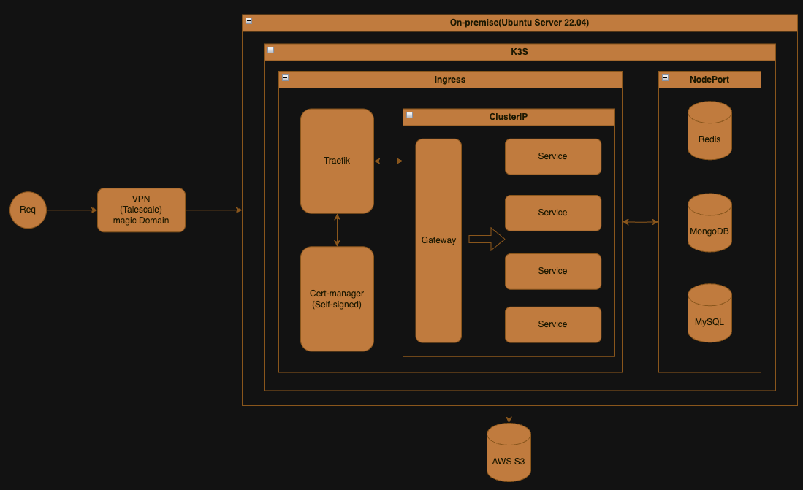

# 🛠️ Infra Setup for K3s

K3s 클러스터 환경에서 Redis, MongoDB, MySQL을 Argo CD로 배포하고, Traefik으로 TCP/TLS 라우팅을 구성하며, Tailscale VPN으로 보안 접근을 지원하는 인프라 구성입니다.

---

## 📦 db/

K3s 내 주요 데이터베이스를 Helm chart로 관리하며, Argo CD로 선언적 배포가 가능하도록 구성되어 있습니다.

### MongoDB
- `mongodb-argocd.yaml`: Argo CD Application 리소스 정의
- `mongodb-values.yaml`: MongoDB Helm 차트 설정값

### MySQL
- `mysql-argocd.yaml`: Argo CD Application 리소스 정의
- `mysql-values.yaml`: MySQL Helm 차트 설정값

### Redis
- `redis-argocd.yaml`: Argo CD Application 리소스 정의
- `redis-values.yaml`: Redis Helm 차트 설정값

---

## 🌐 traefik/

Traefik에서 TCP 포트를 노출하고 TLS를 설정하기 위한 설정입니다.

- `traefik-service-patch.yaml`: Traefik NodePort TCP 포트 패치
- `traefik-patch.sh`: 위 패치를 적용하는 스크립트
- `setup-traefik-cert-selfsigned.sh`: TLSStore, TLSOption, self-signed Secret 설정 자동화

---

## 🔐 vpn/

Tailscale VPN을 통한 보안 클러스터 접근 설정입니다.

- `setup-tailscale.sh`: Tailscale 설치, 로그인, MagicDNS 설정 등 자동 구성

---

## 🖼️ infra.drawio

전체 인프라 구성 시각화 파일입니다. 각 컴포넌트 간 연결 구조를 한눈에 확인할 수 있습니다.

---

## 📌 특징 요약

- Helm + Argo CD 기반 선언형 DB 배포
- Traefik TCP + TLS NodePort 구성
- self-signed 인증서 기반 내부 통신 암호화
- Tailscale VPN + MagicDNS로 외부 노출 없이 안전한 접근 지원

---

## 🗂️ 추후 Argo CD 반영을 위한 YAML 정리 기준

향후 Argo CD 자동화를 위해 YAML 구성 파일은 다음 기준에 맞춰 정리합니다:

- `*-argocd.yaml`
    - Argo CD `Application` 리소스를 정의
    - 각 서비스(예: Redis, MySQL, MongoDB) 별로 하나씩 작성
    - Git 저장소 경로, Helm values 파일 경로 등을 포함

- `*-values.yaml`
    - Helm chart 설정값
    - `helm install` 및 Argo CD에서 동일하게 참조 가능
